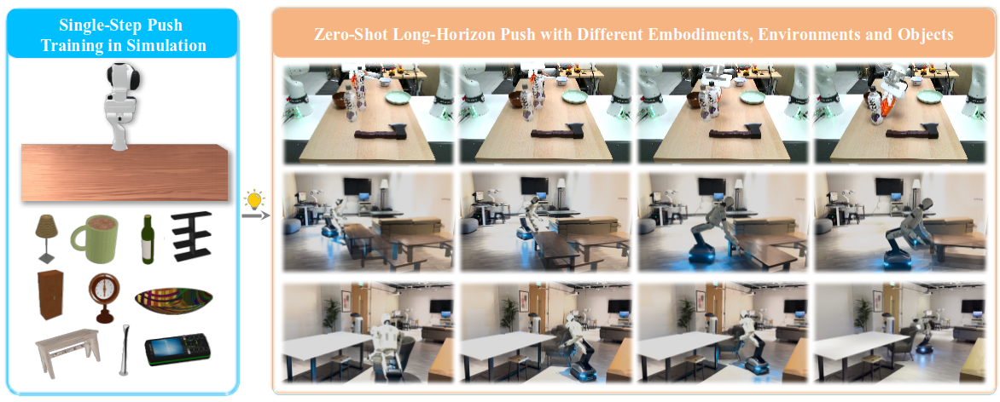

# Receding-Horizon Pushing with Composable Object-Centric Policies

[](https://arxiv.org/abs/2609.23439)

This repository contains the code for the simulation version of our receding-horizon pushing method, which composes a generalizable object-centric pushing policy with stability evaluation and receding-horizon feasibility checking for reliable zero-shot long-horizon pushing across unseen objects, robot embodiments, and environments.




## Installation

### 1. Create the environment

```bash
conda create -n RHP python=3.12.4
conda activate RHP

pip install torch==2.5.1 torchvision==0.20.1 torchaudio==2.5.1 \
    --index-url https://download.pytorch.org/whl/cu124

conda install -c nvidia/label/cuda-12.4.0 \
    cuda-toolkit=12.4.0 --strict-channel-priority
```

Install Vulkan required for simulation rendering on Ubuntu:

```bash
sudo apt-get update
sudo apt-get install libvulkan1
sudo apt-get install vulkan-utils (if ubuntu 22.04, install vulkan-tools)
vulkaninfo
```

### 2. Install Python dependencies

```bash
pip install -r requirements.txt
cd RHP_OCP
pip install -e .
```

### 3. Install third-party components
```
# Install Chamfer-distance from source
cd Receding-Horizon-Pushing
mkdir third_part
cd third_part
git clone https://github.com/krrish94/chamferdist.git
cd chamferdist
python setup.py install

# Install SAM-2
cd third_part
git clone https://github.com/facebookresearch/sam2.git && cd sam2
pip install -e . --no-build-isolation

Download checkpoint: https://github.com/facebookresearch/sam2.

# Install Object-planner
cd third_part
git clone https://github.com/YZY14606/new_object_planner.git
cd new_object_planner
conda install -c conda-forge eigen==3.4.0
CMAKE_ARGS="-DCMAKE_POLICY_VERSION_MINIMUM=3.5" pip install -e .
```


## Assets and checkpoints

We provide the object models and checkpoints used in our experiments, along with a download for SAM2.

### (Optional) Object models

Download `object_model.zip` into `Data_generation/`:

```bash
cd Data_generation
wget --content-disposition \
    --directory-prefix=Data_generation \
    "https://drive.usercontent.google.com/download?id=1qpWHOefGN-q3k8XsAQ0lR1lCrqPnnOq2&export=download&confirm=t"
unzip Data_generation/object_model.zip 
```

### (Optional) Contact prediction checkpoint

Download `checkpoints.zip` into `RHP_OCP/`:

```bash
cd RHP_OCP
wget --content-disposition \
    --directory-prefix=RHP_OCP \
    "https://drive.usercontent.google.com/download?id=1ara1oUzSgnV7qswTbP0idwTW_PHUY-vQ&export=download&confirm=t"

unzip checkpoints.zip
```

### SAM2 checkpoint

Download the official SAM2 checkpoints into `third_part/sam2/checkpoints/`:

```bash
cd third_part/sam2/checkpoints
Download form link: https://dl.fbaipublicfiles.com/segment_anything_2/092824/sam2.1_hiera_large.pt
```

## Quick start
Run one trajectory for test object 1 in `scene_01`:

```bash
cd RHP_OCP

RUN_ID="quickstart"
python simulation/run.py \
    --obj-idx 1 \
    --num-traj 1 \
    --num-procs 1 \
    --object_type test \
    --scene_difficulty scene_01 \
    --run-id "$RUN_ID" \
    --push-test-count 1 \
    --sim-backend cpu \
    --vis
```


## Data generation
```bash
cd Data_generation

NUM_PROCS=1 \
NUM_PROCS_DATA_PROCESS=1 \
DEMO_DIR=scene_data_100 \
OUTPUT_DIR=processed_data_100 \
EPISODES_PER_OBJECT_GENERATED=4 \
EPISODES_PER_OBJECT_USED=2 \
bash Data_generation/scripts/data_gen.sh
```
The current script generates objects 1 through 3. Change the object loop in `Data_generation/scripts/data_gen.sh` if a different object range is required.

## Training

### Training with the provided script

```bash
cd RHP_OCP
DATA_DIR=../Data_generation/processed_data_100 bash script/train.sh
```

The script currently enables Weights & Biases logging. Authenticate first if W&B is used:

```bash
wandb login
```


## Run in simulation

### Single task

Use the command in [Quick start](#quick-start) and adjust:

- `--object_type`: `train` or `test`;
- `--obj-idx`: object index;
- `--scene_difficulty`: `scene_01` through `scene_06`;
- `--num-traj`: total trajectories;
- `--num-procs`: worker-process count;
- `--push-test-count`: number of virtual pushes used for validation;
- `--run-id`: unique experiment identifier.

When `--num-procs` is greater than 1, keep `--sim-backend cpu`. GUI visualization cannot be combined with multiple workers.

### Batch evaluation

`script/test.sh` evaluates all six scenes, test objects 1–12, and train objects 1–10. Set a new `RUN_ID` inside the script before each batch run, then execute:

```bash
cd RHP_OCP
NUM_TRAJ=10 NUM_PROCS=2 bash script/test.sh
```

## Output layout

For a task identified by:

```text
run_id = <run_id>
scene = scene_01
object = test_01
worker = worker_000
trajectory = traj_0
```

the main outputs are organized as:

```text
RHP_OCP/
├── demos/<run_id>/scene_01/test_01/worker_000/video/
├── visualizations/<run_id>/scene_01/test_01/worker_000/traj_0/
├── pose_record/<run_id>/scene_01/test_01/worker_000/traj_0/
│   └── two_pose.npy
└── push_record/<run_id>/scene_01/test_01/worker_000/traj_0/
    └── log.json
```

## Project structure

```text
Receding-Horizon-Pushing/
├── Data_generation/             # Raw trajectory generation and post-processing
│   ├── data_generation/
│   ├── post_process/
│   ├── scripts/data_gen.sh
│   └── object_model/            # Downloaded object assets
├── RHP_OCP/
│   ├── config/                  # Scene and object YAML files
│   ├── datasets/                # Training dataset
│   ├── motion_planner/
│   ├── network/                 # Contact prediction network and losses
│   ├── path_planner/
│   ├── pose_estimate/
│   ├── predictor/               # Checkpoint loading and inference
│   ├── segmentation/            # SAM2 and point-cloud fusion
│   ├── simulation/              # Closed-loop pushing pipeline
│   ├── script/                  # Training, testing, and evaluation scripts
│   └── train.py
├── third_part/                  # Third-party source dependencies
├── requirements.txt
└── README.md
```

## Citation

If this project is useful to you, please cite:

```bibtex
@misc{yuan2026recedinghorizonpushingcomposableobjectcentric,
      title={Receding-Horizon Pushing with Composable Object-Centric Policies}, 
      author={Zhiyi Yuan and Tianrun Hu and Anxing Xiao and Yuhong Deng and David Hsu and Hanbo Zhang},
      year={2026},
      archivePrefix={arXiv},
      primaryClass={cs.RO}, 
}
```

## Contact

If you have any questions about our project, please feel free to open a GitHub issue or contact me at yuanzy9920@gmail.com.

## License

This project is released under the [MIT License](LICENSE).